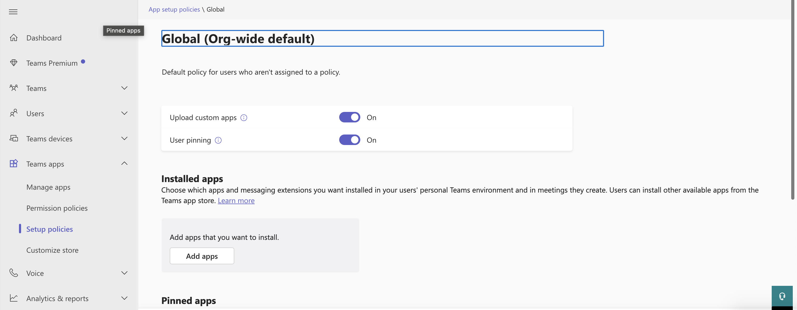
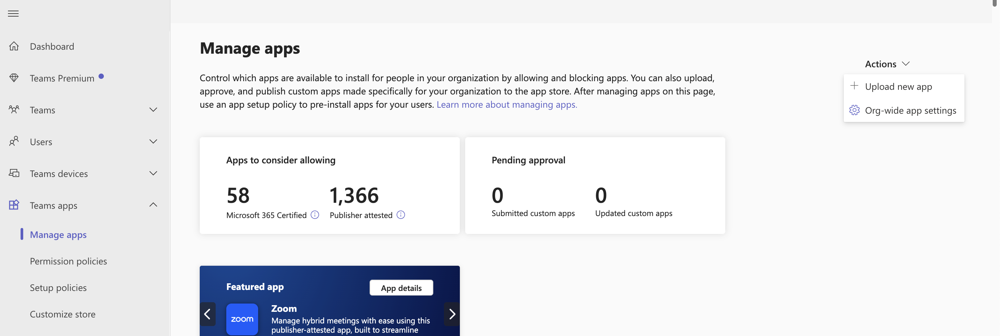
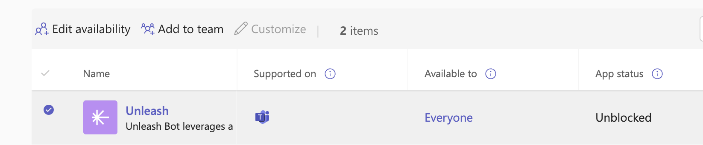

# Initializing the Unleash Teams Bot

This guide walks you through the process of deploying and initializing the Unleash Teams Bot within your Azure environment.

---

## Prerequisites

Before starting, ensure the following prerequisites are met:

- **Azure CLI Installed**  
  You must have the [Azure CLI](https://learn.microsoft.com/en-us/cli/azure/install-azure-cli) installed on your machine.

- **Azure Subscription**  
  You must have access to an active Azure subscription.

- **Permissions**  
  The user performing the setup must have at least **Contributor** permissions on the target resource group.

- **Microsoft Teams Admin Access**  
  You must have access to the [Microsoft Teams admin center](https://admin.teams.microsoft.com/) with sufficient permissions to manage Teams settings and configurations.

---

## Step 1: Create Entra Application and Bot Resources in Azure

### 1. Log in to Azure

Make sure you are logged in with the correct user account and operating in the correct subscription context:

```bash
az login
az account set --subscription "<your-subscription-name-or-id>
```

Replace <your-subscription-name-or-id> with the name or ID of the Azure subscription you intend to use.

### 2. Obtain the Bot Endpoint

Request the **bot endpoint URL** from your Unleash representative.


### 3. Run the Installation Script

Execute the following script to deploy the necessary Azure resources (Entra ID application and Bot Service):

```bash
./install-unleash-teams-bot.sh -resourceGroup <your-resource-group> -botEndpoint <bot-endpoint-url>
```

Replace the placeholders in the script with your actual values:

- `<your-resource-group>` — The name of your Azure resource group  
- `<bot-endpoint-url>` — The bot endpoint URL provided by your Unleash representative

### 4. Share the Output

Once the script finishes, it will output the **Bot ID** and **Password**, which are required for the bot server to function.  
Make sure to provide these values to your Unleash representative to complete the setup.


## Step 2: Grant Admin Consent to the Entra Application

In order for the Unleash Teams Bot to function properly, you must grant **admin consent** to its Entra ID application.

1. Open the following URL in your browser (replace `{bot-id}` with the actual Bot ID from the script output):

`https://login.microsoftonline.com/common/adminconsent?client_id={bot-id}`

2. Sign in using an account with **administrator privileges** in your Azure tenant.

3. Review and approve the requested permissions for the application.

> **Note:** After approval, you may see an error message — this is expected and can be safely ignored.


## Step 3: Install the Unleash Application in the Teams Admin Portal

To make the Unleash Teams Bot available in Microsoft Teams, you need to upload it as a custom app via the Teams admin portal.

1. Open the [Microsoft Teams admin portal](https://admin.teams.microsoft.com/).

2. Navigate to:  
   **Teams apps > Manage apps**

3. Ensure the **Upload custom apps** option is enabled.

   

4. Request the `.zip` file for the Unleash bot application from your Unleash representative.

5. Upload the custom Teams app using the provided `.zip` file.

   

6. After uploading, verify that the Unleash app appears in the list of available applications in the Teams admin portal.

   

7. Ensure the app is made available either **to everyone** or **to the specific team(s)** that should have access.

> **Note:** It may take up to **24 hours** for the custom app to become available for installation in a specific team and to be invited to a channel.
